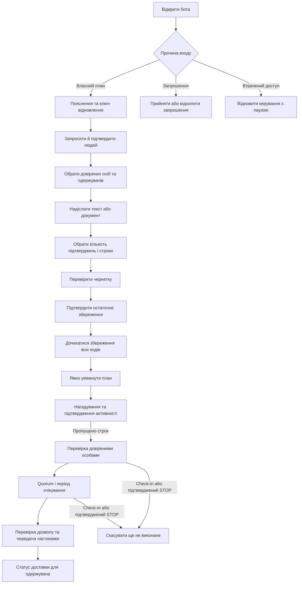
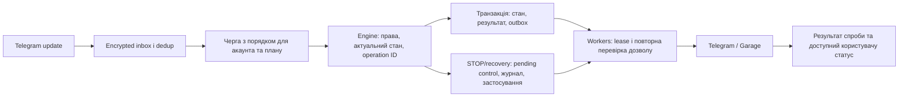

# Zapovit: план відкритого сервісу та Telegram UX

Статус: погоджений план від 30 вересня 2026 року, реалізований наступним робочим проходом після `5ffa173`. Ціль — відкритий сервіс для всіх. Нижче збережені вихідні проблеми й критерії; актуальні команди та поведінка описані в [operations.md](operations.md), докази й межі перевірки — у [verification.md](verification.md). Допуск реальних даних залишається заблокованим до окремих релізних перевірок.

Після реалізації погоджено уточнення UX: звичайний STOP плану або секрету спершу показує п'ятихвилинне підтвердження. Воно замінило початковий задум зупинки без діалогу. Пріоритет і надійна фіксація зупинки зберігаються після підтвердження; `/recoverstop` залишається окремим сценарієм із перевіркою ключа.

Наступне уточнення — розмова по одному запитанню: новий крок надходить новим повідомленням, а вибір у межах того самого кроку оновлює його. Порядок чернетки: довірені особи → одержувачі → вміст → кількість підтверджень → строки → перевірка й остаточне збереження. Підготовка ключа та людей визначається з чинного стану Engine; окремої сесії підготовки не додаємо. Строки життя чернетки залишаються незмінними.

Реалізація охоплює головний огляд стану, наступний крок, приватні мітки, запрошення й архівацію, окремі сесії чернетки та введення, керування блоками, ролі Inbox/отримувача, історію результатів, відображення часу, незалежний STOP секрету, п'ятихвилинні підтвердження STOP і видалення; також черги з lease/повторами/ізоляцією, бар'єр доставки, квоти й резервування, пагінацію, свіжість readiness, окремі backup/restore-сеанси та репліку журналу. Додані наступні міграції `0002`–`0004`; застосовану `0001` збережено.

Пакет F залишається **умовою релізу**, а не автоматичним результатом цих змін: потрібні успішний контейнерний CI, реальні клієнти Telegram, незалежний перегляд захисту, незалежне сховище журналу й перевірений поточний witness, визначена підтримка/алерти та виміряні RPO/RTO на обраному хостингу. Реалізований pipeline не означає, що всі ці зовнішні перевірки вже відбулися.

## 1. Продуктове рішення

Основний сценарій має бути коротким: підготувати людей → створити секрет → перевірити готовність → увімкнути план → час від часу підтверджувати активність. У кожному запитанні видно стан і наступну дію. Додаткові параметри відкриваються в контексті конкретного кроку через «Інші дії»; подробиці залишаються в картках, окремий режим «експерта» не потрібен.

Зберігаємо нативний Telegram-бот і чинну архітектуру Rust / PostgreSQL / Garage. Для наступного етапу достатньо розширити наявні модулі. Mini App, кілька каналів доставки, автоматичні операції з активами й оплати не входять у цей план.

Межі продукту залишаються видимими: пропуск підтвердження запускає перевірку людьми; збереження закриває власнику доступ до вмісту; відновлення повертає керування, а не читання; STOP зупиняє нові відправлення, але не відкликає передані копії. Дані проходять через Telegram і процес бота до шифрування — інтерфейс не повинен обіцяти end-to-end або zero-knowledge захист, якого ця схема не забезпечує. Чинний контракт описано в [операційній документації](operations.md).

## 2. Вихідні проблеми на коміті `5ffa173`

Попередні виправлення вже дають продовження чернетки, захист старих кнопок, конкретні помилки, локалізовані команди та захист STOP від запізнілого результату доставки. Подальші проблеми стосуються цілісності сценаріїв і роботи відкритого сервісу.

| Підтверджений стан у коді | Наслідок | Потрібна зміна |
| --- | --- | --- |
| Конструктор починається з вмісту; вибір людей і порожній список виникають пізніше: [drafts.rs](../crates/adapters/src/bot/drafts.rs). Чернетка має 15 хвилин після додавання, максимум годину: [engine.rs](../crates/application/src/engine.rs). | Людина може втратити підготовку, очікуючи прийняття запрошення. | Перевірка контактів перед початком короткочасної чернетки; довга підготовка плану не містить секретного вмісту. |
| Один `Dialog` на акаунт використовується для чернетки, guardian-коду й recovery: [models.rs](../crates/application/src/models.rs), [bot.rs](../crates/adapters/src/bot.rs). | Перемикання ролі може перезаписати стан конструктора. | Відокремити стан чернетки від активного запиту введення; recovery навмисно інвалідує старі повноваження. |
| Меню показує `Plan.state`; operational readiness повертає лише bool: [menus.rs](../crates/adapters/src/bot/menus.rs), [postgres.rs](../crates/adapters/src/postgres.rs). | «Активний» приховує maintenance, захисне очікування чи незавершену підготовку секретів. | Єдина модель фактичного стану з причиною, строком і дозволеними діями. |
| `Secret` не має назви, `Participant` має лише `confirmed`: [models.rs](../crates/application/src/models.rs). | UUID та числові ID у звичайній навігації; немає завершеного сценарію відкликання запрошення чи архівації контакту. | Безпечні мітки, життєвий цикл запрошення, список залежних секретів перед зміною контакту. |
| Для готовності потрібне збереження кодів усіма guardians; для майбутньої передачі — лише заданий quorum: [acknowledge_grant](../crates/application/src/engine.rs). | «2 із 3» легко сприйняти як достатню готовність до активації. | Два різні показники: «Коди збережено 3/3» та «Для передачі потрібно 2 підтвердження». |
| `threshold = 1` видає кожному guardian повний ключ за [специфікацією](v1-technical-spec.md); явного пояснення в конструкторі немає. | Важливий наслідок вибору прихований за числом. | Обов'язкове коротке пояснення при виборі одного підтвердження; це не розширена опція, яку можна приховати. |
| Кнопка видалення «плану» викликає `DeleteProfile`: [bot.rs](../crates/adapters/src/bot.rs). | Текст не описує повний ефект щодо профілю й recovery. | Назвати дію «Видалити профіль та мої секрети» з точним підтвердженням; окреме видалення секрету зберегти. Участь у чужих планах не видаляється цією дією. |
| `Rearm` також активує готові секрети зі станом `Paused`: [control.rs](../crates/application/src/control.rs). | Загальне ввімкнення може зняти індивідуальну зупинку. | До розширення керування секретами відокремити індивідуальне поновлення від увімкнення плану; перевірити сумісність старих станів. |
| Account створюється до звичайного action limit; повторне прийняття запрошення знову додає owner notice: [bot.rs](../crates/adapters/src/bot.rs), [engine.rs](../crates/application/src/engine.rs). | Персональні ліміти не обмежують публічну реєстрацію; старе посилання може створювати зайві повідомлення. | Загальний admission budget та ідемпотентне прийняття запрошення без повторного повідомлення. |
| `operational_ready` вимагає порожнього inbox, а вибір update має `LIMIT 1`; після помилки обробник повертається до тієї самої події: [postgres.rs](../crates/adapters/src/postgres.rs), [main.rs](../crates/app/src/main.rs). | Постійний трафік або проблемна подія може затримувати передачі всім. | Упорядкована обробка в межах плану, облік спроб і безпечний бар'єр перед доставкою замість глобального очікування порожньої черги. |
| Успішний backup поновлює 24-годинну паузу: [backup.rs](../crates/adapters/src/backup.rs). Повні вибірки обмежено 10 000 записів. | Щоденний backup може постійно блокувати видачу; історія може заблокувати restart. | Окремий протокол завершення backup, цільові запити й обмежене читання сторінками. |

Таблиця фіксує підстави погодженого плану до реалізації. Зміни та виконані регресійні, конкурентні й локальні журнальні випробування наведені в [verification.md](verification.md); ці початкові формулювання не описують поточний стан коду.

## 3. Наскрізний шлях користувача



**Вхід.** Без власного профілю `/start` показує привітання й створення плану; для плану в Setup продовжує підготовку, для активного або призупиненого — відкриває Головну. Кнопка «Головна» під полем введення завжди відкриває огляд. Запрошений учасник одразу бачить запрошення, власника й свої наступні кроки; створювати власний план для участі не потрібно. Прийняття запрошення не дорівнює підтвердженню власником. Прострочене або відкликане посилання пояснює, як отримати нове. Recovery залишається доступним із початкового екрана.

**Підготовка.** Послідовні запитання ведуть через збереження ключа, запрошення та явне підтвердження людей. Ключ надходить окремим повідомленням; користувач зберігає його поза Telegram і натискає кнопку підтвердження саме під ключем. Приватне запрошення надсилається одній людині; вона відкриває бота й приймає його, після чого власник перевіряє її особу та підтверджує. Прогрес виводиться зі збереженого стану профілю, recovery acknowledgment і контактів, без нової сесії підготовки. Очікування контактів може тривати днями; таймер секретної чернетки ще не стартує. На цих запитаннях текст чи файл не приймається як вміст секрету.

**Створення.** Шість запитань мають видиму нумерацію: 1 — хто підтверджує передачу, 2 — хто отримує секрет, 3 — що передати, 4 — скільки підтверджень потрібно, 5 — коли починати передачу, 6 — перевірка та остаточне збереження. Одна людина може мати обидві ролі. На третьому кроці користувач одразу надсилає текст або прикріплює документ, за потреби додає ще блоки й натискає «Продовжити». Форматування, назва, порядок і редагування доступні через «Інші дії». Строки 7/28/7 пропонуються з поясненням; власні інтервали вводяться за окремими запитаннями. На перевірці видно склад, людей, правила й наслідки збереження. Engine повторно перевіряє вибір перед Save. Чернетка зберігає межі 15 хвилин після останнього блоку, максимум годину, та закриття при рестарті.

**Очікування кодів.** Після Save завершальне запитання пропонує перевірити, чи всі довірені особи зберегли коди. Чинний строк — 24 години; після його завершення незавершений секрет стає `SetupFailed`, а початковий вміст власнику вже недоступний. Попередження має бути перед Save, а сценарій повторної підготовки — після збою. За потреби запрошення можна доповнити добровільним сигналом «Готовий зберегти код», який не замінює підтвердження самого коду й не подовжує TTL приховано. Перше ввімкнення пропонується за наявності готового секрету й дозволу Engine; порожній або неготовий план не активується. Для вже активного плану повідомляється готовність нового секрету.

**Щоденне користування.** Підтвердження активності — одна дія. Відповідь містить час фіксації та найближчий новий строк. Для кількох секретів із різними правилами показується найближчий строк із переходом до деталей. Кнопка STOP і `/stop` відкривають підтвердження для всього плану; картка секрету — лише для цього секрету. До натискання «Так, зупинити» стан не змінюється. Підтвердження діє п'ять хвилин; «Скасувати» інвалідує відповідну кнопку підтвердження, тож її запізніле натискання не виконує зупинку. Повернення до передачі після виконаного STOP потребує окремої явної дії. Check-in не вмикає зупинений план. Загальне ввімкнення не знімає індивідуальних зупинок секретів; окреме поновлення показує точний обсяг дії. Цю семантику забезпечує Engine, а не лише напис на кнопці.

**Довірена особа.** У «Вхідних» першими йдуть запити, що потребують дії. Картка пояснює, чий це запит, якого секрету, що саме підтверджується й до якого часу. Код надсилається відповіддю на конкретний запит. Скасування секрету й усього плану розміщуються в деталях; одностайність для скасування не плутається з quorum для передачі.

**Одержувач.** «Отримання» показує лише дозволені цьому користувачу відомості: власника, стан і кількість переданих частин. `Sent` означає успішний результат Bot API, а не прочитання людиною. При `Unknown` повтор не запускається автоматично; запит одержувача пояснює можливий дублікат. Екран статусу не стає новим сховищем для повторного читання всіх секретів.

## 4. Telegram-меню та візуальні правила

Нижче — ескізи тексту й розташування кнопок, не знімки вже наявного інтерфейсу. Дати та кількості умовні.

```text
Zapovit · Мій план
Активний · 2 секрети готові
Найближче підтвердження: 12 жовтня, 18:00 UTC
Дій від вас зараз не потрібно.

[ Підтвердити активність ]
[ Секрети · 2 ] [ Люди · 3 ]
[ Вхідні · 1 ] [ Налаштування ]
[ Зупинити всі передачі ]
```

```text
Підготуємо ваш план
✓ Ключ відновлення збережено
✓ Довірені люди підтверджені
○ Створіть перший секрет

[ Створити секрет ]
[ Люди ] [ Як це працює ]
[ Налаштування ]
```

```text
Передачі призупинено
Ви зупинили план 30 вересня о 14:20 UTC.
Підтвердження активності не зніме цю паузу.

[ Переглянути й увімкнути ]
[ Секрети ] [ Підтвердити активність ]
[ Налаштування ]
```

Коли причина паузи — відновлення сервісу, текст інший: «Передача тимчасово недоступна. Захисне очікування до …». Кнопка увімкнення не обіцяє обійти це обмеження. При кількох причинах показуємо головну й «Усі причини». Якщо часу завершення немає, не вигадуємо дедлайн.

Навігація має такі правила:

- Головна картка власника одночасно є оглядом плану; зайвий перехід із порожнього «Головне меню» прибирається. Для учасника без власного плану головними є «Вхідні» та «Отримання»; власний план — другорядна можливість.
- Основна дія займає окремий рядок. До двох коротких кнопок у рядку; довгі назви та STOP — на всю ширину. Одна система назв і порядку для української та англійської.
- У вкладених екранах стабільні «Назад» і «Головна». Списки мають пагінацію, порожній стан із наступною дією, короткі мітки замість UUID. Числовий Telegram ID залишається в деталях підтвердження особи.
- Кожний перехід до наступного запитання надсилає нове повідомлення. Вибір людей у тому самому запитанні оновлює його; списки й керувальні картки також можна редагувати на місці. Видалене старе меню відкривається заново. Чутливий preview і коди не стають головною навігаційною карткою. Кнопки «Головна» / «Продовжити» під полем введення можна сховати; `/continue` повертає до активної чернетки або наступного запитання, визначеного Engine.
- Callback отримує швидке підтвердження прийняття; повідомлення про завершення з'являється лише після збереження результату. Подвійне натискання показує той самий результат, а не повторює дію.
- STOP доступний кнопкою й через `/stop` із підтвердженням на 5 хвилин. Діалог пояснює обсяг: увесь план або один секрет. До підтвердження чи після його скасування стан не змінюється; скасування робить саме цю кнопку підтвердження недійсною. Повторний або прострочений callback не виконує нову дію. Зупинка за перевіреним ключем через `/recoverstop` не отримує цього додаткового діалогу.
- Підтвердження також потрібне для незворотного Save, видалення та повтору невизначеної доставки. Видалення має власне підтвердження на 5 хвилин замість загального 24-годинного action TTL. Початок видалення спершу фіксує захисну паузу; скасування чи expiry підтвердження не вмикає передачі знову. Після припинення доступу показувати окремо завершення очищення файлів; не називати початок GC завершеним видаленням.
- Емодзі допомагають сканувати, але текст повністю передає зміст. Один акцент на головній дії; відступи й короткі абзаци важливіші за декоративні банери.

Telegram підтримує рядки inline-кнопок, редагування повідомлень і підтвердження callback. У перевіреній документації також є `style` для кнопок (`primary`, `success`, `danger`); це можна застосувати як необов'язкове оформлення після перевірки клієнтів і нашого JSON-адаптера. Коректність дії й розуміння статусу не залежать від кольору. [InlineKeyboardButton](https://core.telegram.org/bots/api#inlinekeyboardbutton), [answerCallbackQuery](https://core.telegram.org/bots/api#answercallbackquery), [можливості ботів](https://core.telegram.org/bots/features#inline-keyboards).

Заголовки й короткі назви полів меню виділяються через нативні `MessageEntity`; зміщення й довжина рахуються в кодових одиницях UTF-16. Імена користувачів залишаються звичайним текстом, без інтерпретації HTML чи Markdown. [MessageEntity](https://core.telegram.org/bots/api#messageentity).

### Базові й додаткові налаштування

| Завжди видно | Відкривається за бажанням |
| --- | --- |
| Одержувачі, люди для підтвердження, потрібна кількість голосів | Пояснення ролей і криптографічної схеми |
| Підсумок строків та конкретні дати | Власні інтервали в чинних доменних межах; часовий пояс |
| Наслідки Save; попередження для одного підтвердження | Докладний перегляд правил перед збереженням |
| Готовність, причина паузи, наступна дія | Журнал подій без вмісту, кодів і ключів |
| Текст і файл у конструкторі | Блок для копіювання, прихований текст, порядок і видалення блоків |
| STOP та статус результату | Зупинка конкретного секрету, відновлення доступу, видалення профілю |

Часовий пояс змінює відображення дат, а не фактичні інтервали політики. Зміна людей, quorum або строків після Save не допускається «розширеним режимом»; потрібен новий секрет із власного оригіналу.

## 5. Мінімальні можливості, які варто додати

1. **Огляд готовності й фактичного стану.** Чекліст підготовки, строки, pending controls, maintenance/hold, стан кодів, конкретна наступна дія. Це основа всіх інших екранів.
2. **Імена та картки.** Мітки контактів і назви секретів із безпечними автоматичними значеннями «Людина 1», «Секрет 1». Власні назви — окремі зашифровані метадані, доступні власнику; вони не змінюють sealed payload чи policy. Видимі учасникам підписи задаються окремим явним правилом, а не витікають із приватної назви власника.
3. **Завершений цикл контактів.** Відхилити/відкликати запрошення, архівувати невикористаний контакт, показати недоступну доставку й залежні секрети. Видалення контакту не викреслює людину з уже запечатаної policy. Для відкликання чинної участі власник зупиняє або видаляє пов'язані секрети; нова конфігурація потребує нового запису.
4. **Повноцінна короткочасна чернетка.** Переставити/видалити блок, явно скасувати, бачити залишок часу й стан файла. Перехід до guardian-запиту не стирає вибір у власній чернетці. Завершення upload обліковується незалежно від відкритого екрана. Чинне очищення чернеток при рестарті залишається явним обмеженням: не обіцяти постійне автозбереження. Збереження чернетки через restart/restore потребувало б окремого рішення, яке не відновлює owner-read вже запечатаного вмісту зі старого snapshot.
5. **Вхідні й підтвердження операцій.** Ролі розділено всередині одного компактного входу; користувач знаходить актуальний запит без прокручування чату. Коротка історія показує зупинку, активацію, підготовку й доставку в межах прав користувача. Інцидент має безпечний номер для підтримки.

Коротке демо на наперед заданому тестовому прикладі можна додати після цих пунктів, якщо перевірки з користувачами покажуть потребу. Демо має окремий стан і не прискорює строки реального плану.

## 6. Надійний внутрішній pipeline



Це цільова організація поверх наявного inbox/outbox, а не пропозиція нового брокера. Перед змінами треба зафіксувати інваріанти й перевірити їх регресіями:

- **STOP має пріоритет і надійний результат.** Після явного підтвердження звичайний STOP проходить захисний шлях; відкриття його діалогу ще не застосовує зупинку. `/recoverstop` проходить цей шлях після перевірки ключа. Вхідні захисні операції не стоять за звичайною навігацією; їхня фіксація не чекає відправлення відповіді Telegram. Авторизація залишається обов'язковою. Уже розпочатий HTTP-запит може завершитися після STOP, але не може повторно активувати передачу.
- **Справедливість без втрати порядку.** Незалежні плани просуваються окремо. Для одного плану зберігається порядок релевантних подій. Перед передачею оброблено всі відомі керувальні події до зафіксованої межі; фінальна перевірка pending controls, epochs і стану залишається безпосередньо перед dispatch.
- **Проблемна подія має обмежені повтори й власника розбору.** `attempts`, `next_attempt_at`, lease та статус ізоляції зберігаються в БД. Некоректне введення чи неавторизована команда отримують обмежене відхилення/ізоляцію й не ставлять чужі плани на паузу. Достовірно прийняту авторизовану захисну команду не позначають виконаною заради звільнення черги: потрібна надійна пауза відповідного плану. Загальний безпечний режим потрібен при втраті цілісності довіреного керувального стану, коли його scope неможливо відновити; сам текст довільного `/stop` не є такою підставою. Критерії довіри, ізоляції та розблокування документуються й тестуються до зміни `operational_ready`.
- **Ідемпотентність усіх мутацій.** Повтор після падіння між SQL commit і UI-відповіддю повертає зафіксований результат. Перевірити create/invite/toggle/save/ack/control окремо; не вважати запис `HandledEvent` після обробки універсальною гарантією. Для S3 потрібні operation ID, повторюване завершення й cleanup незавершених об'єктів.
- **Розділені правила повтору.** Відоме відхилення з `retry_after` очікує свого строку; помилки сховища мають обмежений backoff. Невизначений результат передачі секрету не повторюється автоматично. Помилка малювання меню не повторює вже завершену бізнес-операцію.
- **Контроль обсягу.** Runtime використовує цільові індексовані запити й keyset pagination. Retention визначається окремо для inbox, callback actions, receipts, delivery attempts, control journal і tombstones. Видалення історії не позбавляє можливості безпечно відновитися з підтримуваного backup.
- **Резервне копіювання.** Звичайний успішний backup завершує лише власний maintenance-сеанс і зберігає попередні захисні паузи. Restore/аварія мають окремий протокол очікування й звірки. Узгоджено знімаються БД, об'єкти, журнал, anchor та посилання на потрібні ключі; фіксується digest фактично запущеного образу.
- **Втрата всього хоста.** Щоденна копія не гарантує збереження останнього підтвердженого STOP. Перед публічним запуском визначити незалежне надійне збереження керувальних записів і момент підтвердження користувачу. Якщо після аварії свіжість журналу не доведено, відновлена інсталяція не поновлює передачі автоматично. Шлях append має працювати з обмеженою затримкою при зростанні журналу, без синхронного повного перечитування на кожну дію.
- **Scheduler і readiness.** Помилка одного плану не зриває весь прохід; SQL і lock очікування мають часові межі. Готовність враховує свіжість heartbeat, а не лише збережений boolean після останнього успішного циклу. Метрики й alerts мають виявляти зависання, а не чекати наступного завершеного проходу.

Ліміти Telegram враховуються окремо від швидкості внутрішньої обробки: загальна черга відправлень, обмеження на чат, `retry_after`, пріоритет термінових сповіщень. Поточний адаптер уже має pacing; його слід виміряти й узгодити з персистентною чергою. [Офіційні обмеження відправлень](https://core.telegram.org/bots/faq#my-bot-is-hitting-limits-how-do-i-avoid-this).

## 7. Що додає відкритий доступ

Персональних лімітів недостатньо, якщо реєструватися може будь-хто. Потрібні загальний бюджет сховища, межі незавершених upload/чернеток/запрошень, справедливе використання worker-ів та admission control на нові дорогі операції. Резервування ресурсу атомарне, до його витрати; облік включає encrypted bytes, draft/sealed копії й об'єкти, що ще очікують GC. Окремо обмежуються реєстрація, дорогі Argon-операції та зростання inbox/outbox. При вичерпанні ресурсу сервіс чесно повідомляє, коли створення недоступне; STOP, check-in, recovery, видалення та обслуговування вже прийнятих планів мають резерв ресурсу. Telegram ID не захищає сам по собі від багатьох акаунтів.

Публічний запуск потребує доступних із бота пояснень збереження й видалення даних, підтримки та стану сервісу. Підтримка працює з номером операції та технічними статусами, не просить вміст секрету чи коди й не отримує можливості змінити policy або розкрити дані. Назви користувачів, секретів, токени й payload не потрапляють у logs/metric labels.

Потрібні визначений відповідальний за інциденти, сповіщення про зростання черги, прострочений backup, provisioning failures, недоступність Telegram/Garage та збої cleanup. У разі тривалого збою UI показує затримку, а runtime зберігає чинні захисні паузи. Відновлення після зупинки сервісу перевіряється окремо від простого рестарту процесу.

## 8. Порядок реалізації й перевірки

| Пакет | Результат | Критерій завершення |
| --- | --- | --- |
| A. Backup і відновлення | Розділені backup completion та restore recovery; узгоджений snapshot | Два щоденні backup не продовжують паузу без кінця. Restore в іншу інсталяцію не повертає видалені/зупинені передачі; перевірено crash між кроками. |
| B. Черги й операції | Безпечний бар'єр перед dispatch, bounded retries, per-plan ordering, receipts | Постійний трафік одного акаунта не блокує інші плани; STOP під навантаженням фіксується. Падіння після commit не дублює дію; ізоляція події не губить STOP. |
| C. Масштаб і відкритий доступ | Цільові SQL-запити, retention, квоти та резерв ресурсу | Понад 10 000 історичних подій не блокують startup; багато акаунтів не вичерпують усі ресурси; перевірено заповнений диск і недоступне сховище. |
| D. Єдиний стан і головне меню | Readiness projection, чекліст, строки, причини паузи, точне видалення | Екрани відповідають стану Engine в setup/active/paused/hold/recovery/partial; недоступна дія має пояснення, а не загальну помилку. |
| E. Люди, чернетки й ролі | Мітки, invitation lifecycle, окремі draft/prompt, сторінки списків | Учасник без плану проходить запрошення; власник відповідає на чужий запит і повертається до своєї чернетки; архівація не змінює sealed policy. |
| F. Публічний реліз | Контейнерна інтеграція, вимірювання, підтримка, перевірка моделі захисту | Усі критерії нижче мають збережені результати; synthetic admission знімається окремою перевіреною зміною. |

A–C усувають операційні блокери. D можна робити паралельно, почавши з чинних станів і уточнивши їх після B. E спирається на D; публічний реліз F потребує завершення всіх пакетів. Нові поля й індекси додаються наступними міграціями; застосовану `0001_core.sql` не редагувати.

**Розміщення в архітектурі.** `domain` зберігає правила; `application` отримує типізований огляд стану, результати операцій і сценарії життєвого циклу; `ports` — потрібні цільові запити замість довільного глобального `list`. `adapters/postgres` реалізує запити, `adapters/bot` — екрани й навігацію, `telegram` — рядки кнопок і необов'язкові стилі. `app` відповідає за supervision, черги та метрики. Кнопка або UI projection не замінює повторну перевірку Engine.

**Pipeline випуску:** PR → fmt/clippy/unit/domain/локалізація та чинні cargo-audit/cargo-deny → PostgreSQL та Garage contracts → upgrade попередньої схеми → Docker build і перевірка вразливостей образу → інтеграція з loopback Telegram → сценарії падіння/restore → стенд із синтетичним ботом на реальних клієнтах → зафіксований release artifact → розгортання з rollback-процедурою. Один digest образу проходить стенд і production; склад залежностей та результати перевірок зберігаються разом із релізом. Після незворотної міграції rollback не означає запуск старого бінарника на несумісній схемі.

Умови першого відкритого релізу:

- Виміряні обробка STOP, черга, scheduler lag, навантаження, memory/disk bounds, backup age і restore time. Початковий внутрішній орієнтир: p95 фіксації захисної команди ≤ 2 секунди від запису в inbox під визначеним тестовим навантаженням. Для звичайного STOP відлік починається з події підтвердження, без часу на вибір користувача в діалозі. Це ціль, не виміряна характеристика й не обіцянка швидкості Telegram.
- Зафіксовані та випробувані RPO/RTO для обраного хостингу. Правила відновлення керувального журналу й tombstones не зводяться до віку останнього backup вмісту. Публічні обіцянки встановлюються за результатами випробувань.
- Незалежний перегляд threshold-криптографії й інтегрованої моделі захисту; перевірка ключів/rotation, доступу runtime до БД, cleanup і наслідків старих backup. Це чинна умова допуску проєкту, не нова функція меню.
- Перевірка Telegram Android, iOS і Desktop: вузький екран, великий шрифт, українська/англійська, стара кнопка, видалене меню, перерване введення та недоступний чат. Успіх API-тесту не підміняє цю перевірку.
- Проба з 5–8 новими учасниками: створити план, прийняти запрошення, пояснити quorum і готовність кодів, знайти строк, виконати STOP, відновити навігацію та знайти проблемну доставку. Помилкове розуміння незворотної дії — причина переглянути екран, а не додати довшу довідку.

Пакет D реалізований навколо головної картки з фактичним станом і наступною дією. Приймання її зручності на Android, iOS і Desktop та проба з новими учасниками залишаються окремими кроками пакета F.
