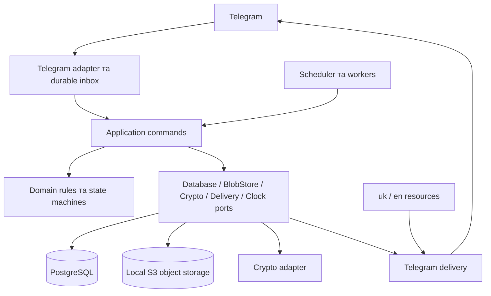

# Zapovit V1 — технічне завдання

Дата перевірки зовнішніх джерел: **6 вересня 2026 року**.

Функціональний обсяг визначає [V1](v1.md). [Загальна концепція](concept.md) дає контекст майбутнього розвитку, але не додає функцій до цього релізу. Це специфікація реалізації; наведений стек ще не підтверджений спільною збіркою чи аудитом готового сервісу.

## 1. Основні рішення

- **Модульний моноліт на Rust:** один виконуваний сервіс і Telegram-бот; PostgreSQL та локальне S3-сховище — окремі інфраструктурні контейнери. Приймання повідомлень, планувальник і працівники доставки працюють у тому самому процесі застосунку.
- **Docker Compose:** постійні контейнери app, db та object-storage; одноразовий запуск міграцій використовує образ застосунку. Kafka та інший брокер повідомлень для V1 не потрібні. Окремих Redis, вебкабінету й публічного REST API немає.
- **Telegram long polling:** не потрібен публічний HTTPS endpoint. Майбутній webhook або інший API підключатиметься через адаптер до тих самих команд застосунку.
- **PostgreSQL зберігає стан, зашифровані тексти й службові конверти, вхідні події та вихідні завдання. Файли зберігаються зашифрованими в локальному object storage**, у БД — їхні метадані та object keys. Дані не залежать від пам'яті процесу або локальних таймерів.
- **Прямі виклики всередині моноліту:** модулі викликають application use cases; фонові завдання потрібні лише для виконання за часом, тривалих операцій та доставки з обліком результату. Універсальна шина подій або інтерфейс майбутнього брокера не входять до V1.
- **Argon2id перевіряє recovery-ключ; XChaCha20-Poly1305 шифрує дані.** Argon2 є функцією виведення ключа/password hashing, а не алгоритмом шифрування файлів. [RFC 9106](https://www.rfc-editor.org/rfc/rfc9106.html).
- **Локалізація:** українська `uk` та англійська `en`; додавання інших мов — через ресурси й реєстр підтримуваних локалей.

Архітектура передбачає додавання адаптерів і політик виконання, але V1 реалізує лише незалежну передачу секретів після неактивності, підтверджень та очікування.

## 2. Бібліотеки та критерії довіри

### 2.1. Базовий стек

Версії нижче — перевірена стартова база для формування Cargo.lock. Для кожного оновлення повторюються перевірки сумісності й безпеки; слово «актуальна» не означає «аудована».

| Компонент | Версія | Використання та підстава вибору |
| --- | --- | --- |
| [Rust](https://blog.rust-lang.org/2026/09/03/Rust-1.98.1/) | 1.98.1, edition 2024 | Stable toolchain, зафіксований у rust-toolchain.toml. |
| [Tokio](https://docs.rs/tokio/1.53.1/tokio/) | 1.53.1 | Async runtime, обмежена паралельність, завершення фонових задач. |
| [teloxide](https://docs.rs/teloxide/0.17.0/teloxide/) / teloxide-core | 0.17.0 / 0.13.0 | Типи та методи Telegram, multipart, помилки. Лише всередині адаптера. |
| [reqwest](https://docs.rs/reqwest/0.12.28/reqwest/) | 0.12.28 | Спільна з teloxide-core гілка HTTP-клієнта, rustls, явні timeouts. |
| [SQLx](https://docs.rs/sqlx/0.9.0/sqlx/) / sqlx-cli | 0.9.0 | PostgreSQL, SQL-міграції, перевірка запитів, транзакції. |
| [aws-sdk-s3](https://crates.io/crates/aws-sdk-s3/1.145.0) / [aws-credential-types](https://crates.io/crates/aws-credential-types/1.3.0) | 1.145.0 / 1.3.0 | Офіційний AWS SDK для локального S3 endpoint; explicit credentials, без залежності від AWS account. |
| [argon2](https://crates.io/crates/argon2/0.6.0) | 0.6.0 | RustCrypto Argon2id для recovery-verifier. |
| [chacha20poly1305](https://crates.io/crates/chacha20poly1305/0.11.0) | 0.11.0 | RustCrypto AEAD, профіль XChaCha20Poly1305. |
| [getrandom](https://docs.rs/getrandom/0.4.3/getrandom/) | 0.4.3 | Системна криптографічна випадковість. |
| [zeroize](https://docs.rs/zeroize/1.9.0/zeroize/) / [secrecy](https://docs.rs/secrecy/0.10.3/secrecy/) | 1.9.0 / 0.10.3 | Контроль життєвого циклу секретних буферів і захист від випадкового Debug-виводу. |
| [hmac](https://crates.io/crates/hmac/0.13.0) / [sha2](https://crates.io/crates/sha2/0.11.0) | 0.13.0 / 0.11.0 | Keyed verifiers, digest незмінної політики; перевірка MAC у constant time. |
| [fluent-bundle](https://docs.rs/fluent-bundle/0.16.0/fluent_bundle/) / [unic-langid](https://docs.rs/unic-langid/0.9.6/unic_langid/) / [fluent-langneg](https://docs.rs/fluent-langneg/0.13.1/fluent_langneg/) | 0.16.0 / 0.9.6 / 0.13.1 | Project Fluent, граматичні форми й вибір мови. |
| [tracing](https://docs.rs/tracing/0.1.44/tracing/) / [tracing-subscriber](https://docs.rs/tracing-subscriber/0.3.23/tracing_subscriber/) | 0.1.44 / 0.3.23 | Структуровані події та метрики тривалості без секретного вмісту. |
| [config](https://docs.rs/config/0.15.25/config/) | 0.15.25 | Типізовані налаштування й валідація на старті. |
| [PostgreSQL](https://www.postgresql.org/docs/release/) | 18.6 | Транзакційне сховище і черги. |
| [Garage](https://git.deuxfleurs.fr/api/v1/repos/Deuxfleurs/garage/releases/tags/v2.4.0) | 2.4.0 | Локальне S3-сховище: один контейнер, persistent data/metadata, окремий приватний bucket. |
| [Docker Compose](https://github.com/docker/compose/releases/tag/v5.5.1) | 5.5.1 | Плагін docker compose, одна інсталяція. |

Допоміжні пакети: serde 1.0.229, serde_json 1.0.151, uuid 1.26.0, time 0.3.55; для внутрішніх health endpoints — axum 0.8.9. Вони не визначають бізнес-контракти або криптографічний формат.

Teloxide 0.17 описує Bot API 9.1, тоді як Telegram уже документує 10.3. Використовуваний V1 набір методів перевіряється контрактними тестами; повна підтримка найновішого API не припускається. `reqwest 0.12` обрано через залежність teloxide-core; `reqwest 0.13` не додається паралельно без потреби. Вбудоване PostgreSQL dialogue storage teloxide не використовується: воно тягне іншу гілку SQLx. [Залежності teloxide](https://crates.io/api/v1/crates/teloxide/0.17.0/dependencies).

Garage обрано для невеликих зашифрованих файлів і простого автономного deployment. MinIO Community архівовано та більше не підтримується; актуальний AIStor Free потребує окремого license file. Garage підтримує потрібні S3 operations, але не повний AWS API: використовуються його власні bucket permissions, без IAM policies, ACL і bucket versioning. Це вибір за відповідністю нашим вимогам, а не твердження про найвищу швидкість або аудит усіх компонентів. Stable 2.4.0 опубліковано 6 вересня 2026; допуск залежить від наших contract/restore tests, не лише позначки stable. [MinIO](https://github.com/minio/minio), [AIStor licenses](https://docs.min.io/aistor/operations/licenses/), [Garage S3 compatibility](https://garagehq.deuxfleurs.fr/documentation/reference-manual/s3-compatibility/).

Є незалежні практичні свідчення: SendRec описує міграцію невеликого production-сервісу на Garage із PostgreSQL та Compose, Datakhi — перехід клієнтського data lake. Водночас вони відзначають роботу з bootstrap, S3-client compatibility та observability. Це корисні відгуки про експлуатацію; їхні строки спостереження й вимірювання на іншому обладнанні не доводять довгострокової надійності або швидкості Zapovit. [SendRec, 17.02.2026](https://sendrec.eu/blog/how-we-replaced-minio-with-garage-for-s3-storage/), [Datakhi, 18.05.2026](https://datakhi.fr/en/blog/garage-migration-production-retour-experience/).

### 2.2. Пороговий розподіл: окремий допуск

Кандидат — **[vsss-rs 6.0.1](https://crates.io/crates/vsss-rs/6.0.1)**, Shamir над GF(256), розподіл довільного 32-байтового ключа. Його README згадує фінансування аудитів, але під час дослідження не встановлено незалежного звіту з точним покриттям потрібного коду цієї версії. Це **кандидат, а не безумовно допущена криптографічна залежність**.

Перед використанням реальних секретів потрібні звіт/незалежний review саме обраного коду, перевірка виправлень, відтворювані тестові вектори та перевірка інтеграції. Якщо ці докази відсутні, інтеграційний прототип працює лише із синтетичними даними; власна реалізація Shamir не підміняє перевірену бібліотеку.

`sharks 0.5.0` виключено через [RUSTSEC-2024-0398](https://rustsec.org/advisories/RUSTSEC-2024-0398.html). Сам факт виправлення цього дефекту у fork не доводить аудит всього fork. Історичний [аудит RustCrypto від NCC](https://www.nccgroup.com/research/public-report-rustcrypto-aesgcm-and-chacha20pluspoly1305-implementation-review/) також не означає автоматичної перевірки всіх наступних major releases.

### 2.3. Політика залежностей

- Використовувати офіційні пакети з відомим походженням; мінімальний набір features, без випадкових Git-залежностей та непотрібних backend-ів.
- Cargo.lock зберігається в Git; build/test виконуються з `--locked`. Оновлення — окремими перевірюваними змінами.
- CI перевіряє RustSec через cargo-audit та джерела, ліцензії й advisories через cargo-deny. Винятки мають причину й строк; невиправлена релевантна криптографічна вразливість блокує реліз.
- Для криптографії перевіряти scope аудиту, commit і зміни після нього. Завантаження crates або відома назва проєкту самі по собі не є доказом безпечності.

## 3. Архітектура моноліту



Це логічні межі одного процесу, а не окремі мікросервіси.

| Модуль | Відповідальність |
| --- | --- |
| accounts / profiles | Telegram binding, locale, owner epoch, профіль і його стан. |
| participants | Запрошення, прийняття ролей, готовність guardians, незмінні адресати. |
| secrets | Draft, блоки, файли, збереження, заборона читання після Save. |
| activity | Last check-in, нагадування, поріг неактивності, operational hold. |
| release | Підтвердження конкретного секрету, quorum, очікування, дозволи на видачу. |
| recovery | Recovery-ключ, перенесення керування, інвалідація старого owner. |
| cancellation / deletion | STOP, одностайне голосування, видалення та tombstones. |
| delivery | Частини повідомлень, retries, невизначений результат надсилання. |
| telegram / localization | Перетворення Update на команду, діалоги, кнопки, представлення. |
| infrastructure | PostgreSQL, S3 BlobStore, криптографія, конфігурація, telemetry. |

Запланована структура:

```text
crates/
  domain/src/                 # бізнес-типи, політики, переходи станів
  application/src/            # use cases, порти, авторизація, unit of work
  adapters/src/               # telegram, postgres, s3, crypto, localization
  app/src/                    # binary, composition root, workers, health
migrations/
locales/uk/main.ftl
locales/en/main.ftl
tests/{integration,contracts,security}/
deploy/{Dockerfile,compose.yaml,postgres/}
```

Domain не залежить від teloxide, SQLx, HTTP або конкретного cipher. Application працює через порти й передає доменні команди та помилки; adapters залежать від цих контрактів, а не навпаки. Транзакції кількох repository належать одному unit of work. HTTP-виклики не виконуються всередині довгої транзакції.

Після запису Telegram update в inbox обробник напряму викликає потрібний use case в цьому процесі. Між модулями немає додаткової пересилки команд через чергу. Inbox захищає приймання від втрати при рестарті: Processed фіксується лише після надійного бізнес-результату або збереження фонового продовження; незавершена обробка повторюється ідемпотентно.

Основні команди: CreateProfile, AcceptInvitation, SaveSecret, CheckIn, SubmitGuardianCode, StopPlan, RequestCancellation, VoteCancellation, BeginRecovery, CompleteRecovery, DeletePlan, DeleteProfile. Доступ до sealed payload має лише release use case; загального `GetSecretPlaintext` для owner, адміністратора або майбутнього API немає.

## 4. PostgreSQL і модель даних

Час — UTC, TIMESTAMPTZ; рішення про строки використовують час PostgreSQL. Внутрішні ID — UUID, Telegram user/chat IDs — BIGINT. Telegram ID не використовується як універсальний доменний ID: майбутня інтеграція додає identity binding до внутрішнього account.

| Сутність | Основний вміст |
| --- | --- |
| accounts | Внутрішній ID, Telegram user ID, перевірений private chat ID, language preference. |
| profiles | Owner account, owner_epoch, стан налаштування/recovery/видалення. |
| plans | Profile ID, control_epoch, Setup/Active/Paused/DeletionPending, last_activity_at, налаштування часу; максимум один невидалений план профілю. |
| invitations / participants | Цільова роль, прийняття, підтвердження власником, строки запрошення. |
| secret_versions | Plan ID, secret_epoch, незмінна політика, її digest, формат ciphertext, nonce, зашифровані блоки, стан готовності/видачі. |
| secret_guardians | Guardian account, share index, verifier MAC та його key ID, підтвердження збереження коду. |
| secret_recipients | Незмінний набір одержувачів, окремий від guardians. |
| encrypted_objects | Невеликі тексти/draft-блоки/службові конверти: ciphertext BYTEA, nonce, key ID, TTL і власник об'єкта; без файлових payload. |
| file_objects / upload_attempts | Object ID/key, encrypted size, SHA-256 ciphertext, crypto format, draft revision, operation ID, lease та стан Pending/Ready/Attached/DeletePending/Deleted. |
| dialogs | Крок конструктора або поточної операції, посилання на draft; без відкритого секрету. |
| release_cases | Secret version, стан, generation, quorum_at, release_at, TTL, snapshots plan control_epoch і secret_epoch. |
| guardian_submissions | Case, guardian, зашифрована частка, час; унікальна пара case/guardian. |
| cancellation_requests / votes | Ціль, snapshot guardians, generation, deadline, голос кожного учасника. |
| recovery_credentials / claims | Public selector, Argon2 PHC verifier, стан, новий account, строк claim. |
| telegram_inbox / cursor | Update ID, зашифрований payload до обробки, статус, offset після durable commit. |
| delivery_parts | Стабільний ledger secret version / recipient / manifest / part; encrypted manifest, Sent/Unknown/інші результати незалежно від case. |
| jobs / outbox / delivery_attempts | Тип задачі, посилання на part, case і generation, доступність, lease token, attempt ID, адресат, результати конкретної спроби. |
| message_cleanup | Chat/message IDs, причина очищення, дедлайн видалення, результат; без вмісту. |
| rate_limits / service_health | Лічильники, стан ingestion, останній успішний poll, operational hold. |
| control_intents / audit_events / deletion_tombstones | Operation ID, actor, target ID, очікуваний epoch, результат і journal sequence; без секретів і повних кодів. |

Обов'язкові constraints: унікальні Telegram bindings; один невидалений профіль власника й один невидалений план профілю; один active case на secret version; унікальні vote/submission; унікальний inbox `(bot_id, update_id)`; унікальна logical part `(secret_version_id, recipient_id, manifest_version, part_id)` та окремий immutable attempt ID; перевірка `1 <= threshold <= guardian_count`.

Після Save політика секрету незмінна: guardians, recipients, threshold та мінімальні строки видачі. Зменшити строки для старих секретів або змінити адресатів через recovery не можна. Налаштування нового плану/секрету не переписують чинні snapshots. Інтервал нагадувань зберігається окремо від абсолютної тривалості неактивності.

Власник не призначається guardian або recipient того самого плану. Recovery на account, який уже має таку роль у плані, не виконує прихованого об'єднання ролей: дозволяється STOP, а для перенесення потрібен інший account. Перенесення на account з іншим профілем також не об'єднує дані.

Файли V1 зберігаються в приватному S3 bucket. BlobStore adapter виконує Put/Get/Head/Delete; він не вирішує, кому дозволено розкриття. Object key — випадковий ID без Telegram ID, назви файла чи секрету; імена й підписи залишаються всередині зашифрованого payload. Немає публічних bucket, S3 credentials для користувачів або presigned download URL у Telegram. Не зберігати оригінальні Telegram file_id/file_path у sealed записах: це окремий шлях до вже розшифрованого файла.

AWS SDK створюється з явно заданими endpoint, region, credentials, `force_path_style(true)` та timeout/retry limits. Не використовуються default AWS credential chain, IMDS або автоматичний пошук AWS account. SDK transport/checksum settings перевіряються на Garage; припущення про сумісність непідтриманих headers не замінює контрактний тест. [AWS S3 client configuration](https://docs.rs/aws-sdk-s3/latest/aws_sdk_s3/config/struct.Builder.html).

### 4.1. Файли та узгодженість PostgreSQL/S3

Файл шифрується застосунком до upload: draft — під KEK, sealed — під DEK секрету. Save дешифрує draft і створює новий зашифрований об'єкт; S3 Copy або перейменування не замінює перешифрування. За ліміту 10 MiB використовується один PutObject із bounded buffer; multipart pipeline у V1 не потрібний. AEAD tag перевіряється повністю до передачі будь-якого plaintext одержувачу. ETag не вважається криптографічною перевіркою.

Спочатку SQL фіксує upload attempt, revision чернетки, object IDs та reservation квоти. Upload виконується поза SQL-транзакцією; один key завжди відповідає тим самим ciphertext bytes. Після успішного upload усіх файлів коротка транзакція перевіряє revision, lease, owner/control epochs та разом зберігає references, frozen policy, code envelopes і cleanup jobs. Лише цей commit означає Save. Між S3 та PostgreSQL немає спільної транзакції; повтор завершеного Save повертає тільки статус.

Якщо збій стався до commit, draft залишається джерелом повторної спроби. Частково завантажені об'єкти не стають секретом. Якщо процес втратив матеріал незавершеного шифрування, нова спроба використовує нові DEK/object IDs; попередня прибирається як orphan. GC працює через наявні PostgreSQL jobs: видаляє лише об'єкти завершених/прострочених attempts без чинних references, після блокування та повторної перевірки. Активний upload захищено lease; attach до DeletePending заборонений. Sweeper повторно прибирає пізній PUT від уже простроченого attempt.

Після Save доступ owner до draft-файлів і preview закрито одразу, навіть якщо cleanup ще триває. Видалення спочатку фіксує tombstone та припиняє доступ; object keys для очищення зберігаються до підтвердженого DeleteObject або NotFound. Для незавершеного/простроченого upload перший Delete не прибирає GC-запис: необхідні припинення старих upload/retry workers і повторне очищення після їхніх запитів. Поки можливий пізній PUT або результат такого запиту невизначений, key зберігається, sweeper повторює перевірку, а cleanup лишається pending. Timeout/5xx не означає видалення. Відсутній чи пошкоджений Attached object блокує видачу відповідного секрету та створює помилку, а не обхід правил.

## 5. Криптографія і життєвий цикл секрету

### 5.1. Межа довіри

Telegram та backend отримують вхідні тексти, файли й коди. Backend створює ключі й частки. Шифрування захищає збережені об'єкти, а write-only режим обмежує application API; це **не zero knowledge і не захист від зловмисного оператора**.

Сервер після отримання quorum часток технічно може відновити ключ до завершення очікування. Post-quorum delay — перевірювана політика сервісу, не криптографічний timelock.

### 5.2. Ключі та формати

| Матеріал | Вимога |
| --- | --- |
| DEK секрету | Незалежні 32 випадкові байти на secret version. |
| AEAD nonce | Нові 24 випадкові байти на кожне шифрування XChaCha20-Poly1305; tag 16 байтів. |
| Платформний KEK | 32 випадкові байти, versioned keyring поза PostgreSQL; лише для службових конвертів, draft та active-case material. |
| Guardian verifier key | Окремий 32-байтовий HMAC-ключ поза PostgreSQL; versioned key ID. |
| Recovery secret | 32 випадкові байти та окремий випадковий public selector. |
| Argon2id verifier | Version 19, salt 16 байтів, output 32 байти; стартові параметри: memory 65536 KiB, iterations 3, parallelism 1. |

Параметри Argon2 — наше рішення для цільового сервера; виміряти час і RAM, не називати їх дослівним рекомендованим профілем RFC. Максимум два Argon2 обчислення одночасно через bounded blocking pool. Клієнт не задає їхню вартість; PHC-параметри перевіряються до обчислення.

Випадковість — тільки OS CSPRNG; помилка генерації перериває операцію. Перевірка MAC/hash — constant time. Секретні буфери не реалізують довільне Debug/Serialize; застосовуються secrecy та zeroize, але це не гарантія стирання всіх копій.

Контейнер має version, cipher suite, nonce, ciphertext і tag. AAD включає domain separator, format version, secret_version_id, object type/ID та digest frozen policy. Для canonical encoding явно задаються порядок полів, довжини та кодування; JSON із довільним порядком полів не використовується як випадковий canonical формат. Mutable owner Telegram ID не входить до AAD, щоб recovery не вимагав дешифрування.

Guardian-код містить version, ідентифікатор secret version, distinct share index, закодовану частку та checksum копіювання. Checksum не замінює автентифікацію. Загальна довжина коду — до 256 символів; формат має однозначний parser, обмеження довжин та тестові вектори. Регістр секретної частини не змінюється.

У БД зберігається HMAC-SHA-256 від однозначного представлення secret version, policy digest, guardian account, index і частки. Повний код не є постійним verifier. Сумісний RNG adapter для vsss-rs має бути перевірений збіркою; його актуальна гілка використовує rand_core 0.10.

Для `t >= 2` використовується бібліотечний Shamir. `t = 1` — окремий формат SingleApproval: кожен із призначених guardians отримує повний DEK, із тим самим account binding і HMAC-перевіркою. Це не виклик Shamir із непідтримуваним threshold; vsss-rs відхиляє значення менші за 2. UI прямо пояснює, що будь-яка одна призначена людина володітиме повним ключем. Тип схеми входить до frozen policy та формату коду. [Опублікований source vsss-rs](https://crates.io/api/v1/crates/vsss-rs/6.0.1/download).

### 5.3. Draft → Save → готовність

1. Вхідна подія надійно зберігається в encrypted inbox. Текст і metadata чернетки шифруються KEK у PostgreSQL; файли — KEK перед записом у S3. Файли не потрапляють у незашифровані disk temp або logs.
2. Конструктор працює зі структурованими блоками. Preview дозволений лише owner, тільки для draft до Save.
3. Save генерує DEK, шифрує об'єкти й створює shares та verifiers. Спочатку завантажує sealed-файли в S3 за правилами §4.1; потім одна SQL-транзакція зберігає policy, encrypted text, file references, encrypted code-delivery envelopes та cleanup jobs. Повторний завершений Save з тим самим draft ID повертає той самий статус.
4. Після commit прибираються джерела з live inbox/draft і ставляться на видалення S3 draft-об'єкти та Telegram-повідомлення/preview. Owner read/preview/export вже заборонені незалежно від готовності guardians.
5. Коди надсилаються тільки відповідним guardians у приватні чати. Кнопка збереження фіксує згоду користувача, а не доказ clipboard. Для кожного секрету всі призначені guardians підтверджують отримання своїх кодів; інші секрети можуть стати готовими незалежно.
6. Тимчасовий конверт коду зберігається до явного підтвердження guardian «Зберіг» або завершення provisioning TTL 24 години. Самого Bot API Sent недостатньо: до підтвердження можливий контрольований повтор тому самому guardian. Підтвердження транзакційно прибирає конверт і створює Telegram cleanup job. Після TTL решта конвертів очищається; якщо готовність не досягнута, секрет переходить у SetupFailed і не активується. Owner може створити новий запис із власного оригіналу.

Після provisioning sealed DEK та повний набір shares не зберігаються як постійний escrow. Платформний KEK не повинен відкривати sealed payload сам по собі. Тимчасові конверти й їхні резервні копії залишаються окремою межею довіри.

### 5.4. Підтвердження, видача і повторне ввімкнення

Guardian подає код зі свого прив'язаного account як відповідь на конкретний запит бота. Збережений reply-to message binding визначає case ID та generation; довільний текст коду поза цим діалогом не є підтвердженням. Перевіряються роль, version/index, HMAC, стан справи й унікальність внеску. Запізніла відповідь старому case не переноситься в новий навіть за чинного коду. Частка зберігається зашифрованою під KEK з AAD, що включає case ID; plaintext inbox після обробки прибирається.

Quorum запускає встановлене очікування. Після його завершення release worker повторно перевіряє дозволи, реконструює DEK та перевіряє AEAD; жодні байти об'єкта не надсилаються до успішної перевірки його tag. Для повторної доставки матеріали active case можна тримати зашифрованими до завершення або максимум 7 днів після початку доставки. Після TTL матеріали очищаються, незавершена видача переходить у NeedsAttention/Partial. Повтор потребує нового case, нових підтверджень і повного очікування; вже Sent частини не надсилаються знову, а Unknown потребують явного рішення одержувача про повтор.

Cancel/STOP очищає active-case material та інвалідує approvals. Повторне ввімкнення створює новий case, а guardians заново подають **ті самі чинні коди**. Це операційний reset; він не відкликає математичні частки, які вже скопіювали учасники або оператор.

За компрометації кодів старий секрет видаляється та створюється заново із зовнішнього оригіналу. Автоматична заміна DEK без достатніх часток або escrow не обіцяється; recovery власника не викликає дешифрування.

## 6. Telegram ingestion і конструктор

### 6.1. Надійне приймання

- Один активний poller на bot ID; друга копія не запускає паралельний getUpdates. Leadership перевіряється через PostgreSQL, із припиненням polling при втраті DB-з'єднання.
- Вузький raw getUpdates adapter використовує reqwest; решта викликів — teloxide. Це дозволяє зберегти первинний JSON, не втрачаючи невідомих SDK полів.
- Batch надходить у encrypted inbox та cursor в одній транзакції. Лише **після commit** наступний getUpdates отримує новий offset. При недоступній БД offset не просувається.
- Стандартний teloxide Polling не використовується як durable acknowledgement boundary. [Polling](https://docs.rs/teloxide/0.17.0/teloxide/update_listeners/struct.Polling.html), [getUpdates](https://core.telegram.org/bots/api#getupdates).
- Processed payload видаляється одразу після надійної обробки; dedup metadata зберігається 30 днів. Для необроблених подій retention не означає автоматичне видалення: backlog спричиняє hold та сигнал оператору.
- Після тривалого періоду без подій враховується можливий новий випадковий update ID. Cursor відновлюється контрольованим poll без stale offset після тижня без updates; `drop_pending_updates` для штатних рестартів заборонений.

Обробка впорядкована для одного account/profile. Система не пропускає скасування через важку обробку файла: отримання контрольних команд має окремий бюджет, завантаження й Argon2 — обмежені фонові роботи. Невідомі типи подій не трактуються як підтвердження активності.

### 6.2. Авторизація та діалоги

Actor визначається з підтвердженої Telegram-події, а не з тексту, callback payload або введеного username. Для секретних операцій потрібен приватний чат. Chat ID для доставки береться з перевіреного binding одержувача, а не з місця подачі коду.

Callback містить короткий випадковий action token; сервер зв'язує його з actor, profile, owner/control epoch, дією й строком. Recovery, destructive confirmations та старі draft-кнопки інвалідуються після переходу стану. Повторний STOP і CheckIn ідемпотентні. Звичайні команди доступні через меню навіть після прострочення старої кнопки.

Учасник має сам почати діалог із ботом. Запрошення — одноразове, обмежене в часі; прийняття іншою людиною не стає остаточним binding без підтвердження власника.

### 6.3. Вміст та оформлення

Payload — versioned масив блоків `Text`, `Copyable`, `Spoiler`, `File`, із підписами/коментарями; це не виконуваний шаблон. Користувач не вводить placeholders. Ім'я файла, текст і його порядок входять у зашифроване тіло.

Telegram presenter формує текст та explicit entities, підтримуючи заплановане Markdown-оформлення без ручного синтаксису користувача. Entity offsets обчислюються в UTF-16. Secret bytes/Unicode не нормалізуються, не перекладаються та не підставляються повторно в шаблон.

CopyTextButton використовується для значень до 256 символів; для довших — блок для ручного копіювання або файл зі збереженням точного вмісту. Spoiler не вкладається в code/pre. Довгі повідомлення розбиваються зі збереженням блоків/оформлення; незручний для поділу великий секрет передається файлом без зміни байтів. [Entities](https://core.telegram.org/bots/api#messageentity), [CopyTextButton](https://core.telegram.org/bots/api#copytextbutton).

Файл приймається лише через Telegram file upload; довільні URL для завантаження не підтримуються. Streaming download має byte cap незалежно від заявленого file_size. Оригінальний файл не виконується й не розпаковується. Ні Telegram file URL із bot token, ні returned file_id не потрапляють у logs або довготривалу історію payload.

### 6.4. Очищення повідомлень

Cleanup job створюється транзакційно після успішного збереження або обробки. Зберігаються лише chat ID, message ID, причина й час. До jobs потрапляють вхідні секрети, введені коди та bot previews; видані ключі видаляються за кнопкою «Зберіг — видалити».

Підтвердження кнопки належить користувачу. Якщо вік повідомлення вже не дозволяє видалення, бот пропонує ручне очищення. Повторна відповідь «message not found» після вже успішного очищення не запускає нескінченний retry. Видалення повідомлень не відкликає збережених кодів і не доводить стирання сторонніх копій.

## 7. Активність, стани й контроль видачі

### 7.1. Час

`inactive_at = last_activity_at + inactivity_timeout`. Для нового плану last_activity_at встановлюється під час явного ввімкнення. Нагадування не змінюють цей час; окремих сесій відповіді немає. CheckIn приймається будь-коли від чинного owner.

Для збереженого секрету effective inactivity_timeout та release_delay не менші за відповідні frozen minima. Збільшення строків застосовується також до незавершених передач; зменшення налаштувань ніколи не прискорює вже відкритий case або видачу раніше за sealed policy. Нове release_at не може бути раніше вже зафіксованого.

`release_at = quorum_at + release_delay`. Quorum фіксується один раз для конкретного case; дублікати не прискорюють строк. Збереження code submission і перехід у Waiting відбуваються під тим самим lock.

### 7.2. Машини станів

| Об'єкт | Стани й правила |
| --- | --- |
| Профіль | Setup → Ready; окремі RecoveryPending, DeletionPending, Deleted. Володіє максимум одним невидаленим планом. |
| План | Setup → Active; STOP/recovery → Paused; видалення → DeletionPending → Deleted. Із Paused тільки явне ввімкнення. |
| Секрет | Provisioning → Armed → Delivered; помилка підготовки → SetupFailed. Partial/NeedsAttention потребують явного повтору незавершеної видачі; quorum не переноситься між версіями. |
| Release case | Collecting → Waiting → Ready → Delivering → Complete; альтернативи Cancelled, Expired, NeedsAttention, Partial. |
| Delivery part | Queued → Claimed → Dispatching → Sent; альтернативи RetryableFailed, PermanentFailed, Unknown, Cancelled. |
| Cancellation vote | Open → Approved / Rejected / Expired / Invalidated. |

CheckIn після початку перевірки скасовує її незавершені частини та починає новий відлік активності. STOP, recovery й одностайне скасування залишають відповідний scope вимкненим до явного ввімкнення. Додавання нового секрету або нагадування не знімає цю зупинку.

Планувальник починає автоматичну передачу тільки для Armed секретів. Коли всі частини доставлено всім recipients, секрет стає Delivered; CheckIn, rearm або наступна неактивність не запускають його знову. Статуси частин зберігаються на рівні secret version/recipient/part, незалежно від зміни case; повтор неповної видачі не скидає Sent.

Collecting має TTL 30 днів; прострочені submissions очищаються. Якщо owner усе ще неактивний і scope не скасований/призупинений, новий case може бути створений після 7 днів cooldown; потрібні нові подачі кодів і повний період очікування. Cancelled не переходить у цей автоматичний цикл.

### 7.3. Транзакції та гонки

Рішення щодо одного профілю серіалізуються row lock; стабільний порядок блокувань: profile → plan → secret/case → delivery part. Використовуються короткі транзакції, unique constraints і повторення транзакції при transient serialization/deadlock failure. `SKIP LOCKED` застосовується для claim jobs, не для пропуску перевірок доступу. [PostgreSQL locking](https://www.postgresql.org/docs/18/explicit-locking.html), [queue-like SELECT](https://www.postgresql.org/docs/18/sql-select.html).

STOP плану, recovery, CheckIn із відкритою справою та видалення плану збільшують plan control_epoch і скасовують ще не відправлені intents. Скасування/видалення окремого секрету змінює лише його secret_epoch; сусідні секрети продовжують незалежну роботу. Worker перед Dispatching повторно перевіряє обидва epochs, стан профілю/плану/справи, час, quorum, адресата й operational hold. Claim задачі ще не є дозволом надсилати.

**Commit Dispatching — межа початку зовнішньої дії.** HTTP відбувається після commit; між БД і Telegram немає спільної транзакції. STOP блокує нові dispatches, але не гарантує відкликання вже розпочатого запиту. UI окремо показує зупинені та in-flight/Unknown частини. Не позначати весь секрет безпечно скасованим, якщо частина вже могла бути доставлена.

### 7.4. Недоступність сервісу

Перед видачею потрібні актуальний успішний polling, оброблений inbox і відсутність відомого збою нагадувань. Restart/DB outage/polling gap понад 2 хвилини ставить зачеплені передачі в operational hold. Після відновлення backlog обробляється до нових release jobs.

Якщо немає ризику втрати updates, власнику повторюється повідомлення, а earliest release переноситься не раніше ніж на повний release_delay після відновлення. Якщо перерва перевищила 24 години, події Telegram могли зникнути: старих approvals недостатньо, потрібен новий case із повторними підтвердженнями. Простій не імітує смерть і не спричиняє масової видачі. [Зберігання updates](https://core.telegram.org/bots/api#getting-updates).

## 8. Recovery, голосування та видалення

### 8.1. Recovery-ключ

Токен має публічний selector і 256-бітний секрет у придатному для копіювання кодуванні. БД зберігає Argon2id PHC verifier, а не plaintext токен. Вхід перевіряється зі строгими bounds до Argon2; помилки не розкривають власника selector.

Початковий токен надсилається owner як одноразова видача з кнопкою очищення; профіль не активується без підтвердження його збереження. Encrypted envelope має TTL 15 хвилин і видаляється одразу після підтвердження. Якщо видачу не завершено, Setup зберігається, а нова спроба видає заміну й інвалідує попередній токен. Повторний показ чинного recovery secret після завершення видачі недоступний. Авторизована заміна чинним owner також спочатку ставить план на pause, зберігає старий credential до підтвердження нового та атомарно інвалідує його при завершенні.

Відновлення з нового Telegram account:

1. Перевірити recovery token з урахуванням rate limits, зафіксувати target account із Telegram actor.
2. Транзакційно призупинити план, інвалідувати pending cases/intents і зареєструвати короткий recovery claim. Старий owner більше не може відновити передачі під час claim.
3. Видати новому account новий recovery token; claim і одноразовий encrypted delivery envelope живуть 15 хвилин. До підтвердження нового токена не залишати власника без можливості повторити цю видачу за перевіреним старим token у тому самому claim.
4. Після підтвердження target account атомарно замінити owner binding, збільшити owner/control epochs та інвалідувати старий recovery token. План залишається Paused. Прострочений claim не відновлює передачі; новий attempt потребує перевірки recovery знову.

Конкурентні claims не можуть створити двох owners. Новий recovery token прив'язаний до того самого профілю, а не до старого Telegram username. Guardian/recipient bindings і frozen policy не змінюються. Recovery не має decrypt/export/reissue-guardian-code повноважень; володіння ним дозволяє STOP та керування, тому це чутливий credential, а не «нешкідливий код».

### 8.2. Одностайне скасування

Ініціатор має бути guardian відповідного scope. Snapshot включає всіх guardians секрету; для плану — унікальних guardians усіх його збережених невидалених секретів. Порожня множина не дає автоматичного дозволу. Голос ініціатора також явний.

Один Open request на scope/generation, TTL 7 днів. Голоси прив'язані до request, actor і snapshot; мовчання не є згодою. Зміна складу секретів/owner generation інвалідує snapshot. Сам запит не зупиняє видачу; одностайність транзакційно виконує той самий StopScope, що й owner, до початку ще не відправлених частин. Профіль не видаляється і керування guardians не передається.

### 8.3. Видалення й резервні копії

Початок Delete негайно ставить scope на pause і збільшує epoch. Коротке підтвердження, чинне 5 хвилин, запускає purge. Відмова або expiry не відновлює передачі автоматично.

Purge плану прибирає його ciphertext із PostgreSQL, drafts, code envelopes, submissions, налаштування та невиконані передачі, а файли — через ідемпотентні S3 delete jobs. Cleanup jobs і object keys не видаляються каскадом до завершення очищення; профіль і його recovery credential залишаються для подальшого керування. Новий план отримує новий ID і не успадковує старих jobs або кодів. Purge профілю додатково видаляє owner binding, recovery credentials/claims та всі його плани. Облікові записи людей, потрібні для участі в чужих планах, і самі чужі плани не видаляються каскадом. Залишається мінімальний tombstone без вмісту та контактів для заборони повторного виконання старих intents. Recovery не відновлює видалених планів.

PostgreSQL DELETE не доводить знищення даних у WAL, snapshots чи старих backups. Початковий operational policy: щоденний зашифрований backup, retention 7 днів, ціль RPO 24 години та RTO 4 години. Це цілі, які перевіряються restore drill, а не гарантії без вимірювань.

Власник бачить окремо «активні передачі зупинено», «дані прибрано з робочого сховища» та завершення строку очищення керованих резервних копій. Другий статус вимагає також завершення S3 cleanup; недоступне сховище залишає очищення pending. Не повідомляти про миттєве повне фізичне стирання. Backup охоплює PostgreSQL, файлові об'єкти, keyrings та актуальний control journal; їхня наявність розширює межу довіри оператора.

Для V1 backup має коротке вікно maintenance: призупинити нові uploads/Save та object deletion, дочекатися поточних операцій, зробити SQL snapshot і manifest потрібних immutable object keys, скопіювати їх та перевірити розміри/checksums. Поки копіювання не завершене, GC не прибирає об'єкти manifest; обробка STOP/CheckIn зберігається, фізичне очищення очікує завершення backup. Копія вважається придатною тільки як повний набір БД й об'єктів, збережений поза робочими volumes. Restore перевіряє всі references перед дозволом видачі; секрет із відсутнім файлом залишається заблокованим.

Окремий control journal зберігає видалення, STOP, CheckIn, recovery-перенесення та відкликання credentials. Це append-only файл на окремому volume поза PostgreSQL backup, із зашифрованими й автентифікованими записами, operation ID, монотонним sequence та ланцюжком попередніх записів. Він не містить секретних payload або guardian-кодів; owner bindings і recovery verifiers у ньому також зашифровані.

Durable boundary: спочатку транзакційно зафіксувати авторизований control intent і зупинити відповідний scope; далі записати intent у журнал із fsync; потім ідемпотентно завершити mutation/purge в PostgreSQL і підтвердити користувачу. Незаписаний intent залишає scope на hold. Записаний, але ще не застосований intent застосовується після рестарту; скасування після цієї межі не стирає історію. Для CheckIn попередній режим плану повертається лише через compare-and-set за очікуваним epoch: сама перевірка активності не знімає вже наявний STOP, а новіші STOP/recovery/delete перемагають. Intent містить scope epoch; journal replay дотримується цього порядку й не повертає старіший control state. Journal writer має одного лідера; checkpoint/high-watermark зберігається разом із backup manifest і перевіряється проти окремого актуального журналу.

Після restore сервіс стартує в maintenance hold. До приймання команд профілів і запуску workers застосовуються journal intents, актуальні owner bindings, відкликання й tombstones; старі delivery attempts інвалідуються. Старому owner не повертаються права лише тому, що його запис присутній у backup. Якщо журнал пошкоджений, неповний або його актуальність не підтверджена, відповідні профілі залишаються заблокованими. Ротація KEK або видалення рядка не називаються гарантованим cryptographic erasure.

## 9. Outbox, retries і Telegram-ліміти

| Операція | Виконання у V1 |
| --- | --- |
| Меню, перегляд стану, вибір мови, крок діалогу | Прямий виклик use case; звичайна відповідь Telegram без durable outbox, через спільний limiter. |
| CheckIn, STOP, рішення recovery або скасування | Прямий пріоритетний виклик; чинні правила авторизації, транзакцій і control journal. Зміна стану не чекає черги доставки. |
| Завантаження файла, Argon2 | Обмежена паралельність усередині процесу; без блокування control commands. Тривале завантаження має збережений стан продовження. |
| Нагадування, перевірка строків, видача кодів/секретів, cleanup | PostgreSQL jobs/outbox та workers того самого процесу; стан і необхідні повтори переживають рестарт. |

Jobs/outbox — локальні записи роботи й намірів доставки у PostgreSQL. Одна зовнішня дія не проходить додатковий ланцюжок «job → подія → broker → consumer». Бізнес-рішення й потрібний delivery intent записуються однією транзакцією; перед зовнішньою дією знову перевіряються права та стан. Збережений intent містить посилання на об'єкти, а не відкриті секрети.

Брокер не замінює шифрування, авторизацію, перевірку скасування або облік невизначеної доставки. Зокрема, гарантії Kafka не роблять HTTP-відправлення до Telegram автоматично exactly-once: для зовнішнього одержувача потрібна його участь у протоколі. [Гарантії доставки Kafka](https://kafka.apache.org/41/design/design/#message-delivery-semantics).

Jobs мають available_at, lease_until, attempt_id, lease_token, locked_by, dedup key. Claim — коротка транзакція `FOR UPDATE SKIP LOCKED`; виконання й завершення — окремі операції. Кожен перехід до Dispatching — compare-and-set за актуальними token, станом і строком lease. Прострочений Claimed можна повернути в чергу з новим token, але прострочений Dispatching переходить у Unknown, а не у сліпий повтор. Явний retry створює нову attempt; пізня відповідь попереднього worker дописує тільки його attempt, не перезаписує нову. Відомий успішний результат зберігається навіть після STOP, щоб UI не приховав фактичну доставку.

Перший дозволений release створює незмінний manifest частин для кожного recipient, зашифрований DEK секрету; файли представлені посиланнями на sealed objects. Manifest переживає expiry case та містить точне оформлення. Ledger logical parts не залежить від case/generation: наступний case дозволяє лише нові спроби недоставлених частин, а не створює весь набір заново.

| Відповідь | Дія |
| --- | --- |
| Успішний Bot API result | Записати chat/message IDs, Sent; API acceptance не означає прочитання. |
| 429 | Повторити після retry_after плюс jitter; оновити загальний limiter. |
| Доведена тимчасова відмова до можливого надсилання | Exponential backoff, full jitter: base 1 с, cap 60 с, до 6 спроб. |
| Постійна помилка / бот заблокований | PermanentFailed, зрозумілий статус, без нескінченного retry. |
| Timeout, reset або 5xx після можливого прийняття секрету | Unknown, без автоматичного повтору секретної частини. Явний повтор одержувачем із повідомленням про можливий дублікат і повторною перевіркою policy. |

Доступний retry не відкриває owner payload і не змінює адресата. Звичайні несекретні нагадування допускають повтор із тією самою business idempotency key. Для відправлення секретів немає загального exactly-once: Bot API не надає універсального idempotency key. [sendMessage](https://core.telegram.org/bots/api#sendmessage), [ResponseParameters](https://core.telegram.org/bots/api#responseparameters).

Перевірені зовнішні межі: updates — до 24 годин; deleteMessage — повідомлення молодші 48 годин; getFile на hosted API — до 20 MB, новий sendDocument — до 50 MB; текст — 4096 символів, підпис — 1024 після formatting parse. Bot-wide rate guideline — близько 30 повідомлень/с, для одного чату — орієнтир 1/с. Наша конфігурація нижча за ці межі. [Telegram FAQ](https://core.telegram.org/bots/faq), [deleteMessage](https://core.telegram.org/bots/api#deletemessage).

## 10. Конкретні початкові ліміти

Це **проєктні defaults для V1**, а не вимоги Telegram або доведені безпечні строки спадкування. Вони налаштовуються deployment configuration; зміни не послаблюють sealed policy.

| Налаштування | Default / межа |
| --- | --- |
| Планів / профілів | 1 план на owner, 1000 активних профілів на інсталяцію. |
| Секретів / блоків | 50 секретів на профіль, 20 блоків на секрет. |
| Файли | До 3 на секрет; 10 MiB на файл, 25 MiB на секрет, 250 MiB на профіль. |
| Текст і metadata | До 32 KiB UTF-8 на секрет; сумарний encrypted envelope також обмежений. |
| Guardians / recipients | До 10 guardians і 10 recipients на секрет; до 20 унікальних guardians плану. |
| Threshold | 1 ≤ t ≤ n; UI показує наслідок одного підтвердження. Приклад 3 із 5 не застосовується без п'яти готових людей. |
| Нагадування | 7 днів; допустимо 1–30 днів. |
| Неактивність | 28 днів; 2–365 днів та не менше двох інтервалів нагадувань. |
| Post-quorum очікування | 7 днів; допустимо 1–30 днів. |
| Collecting / повтор | TTL 30 днів; після expiry cooldown 7 днів, тільки без STOP/Cancel. |
| Голосування скасування / запрошення | TTL 7 днів / 24 години. |
| Draft / provisioning | Draft idle TTL 15 хвилин, hard TTL 1 година; provisioning 24 години. Це не сесії check-in. |
| Звичайні дії | 30/хв на account, burst 10. |
| Guardian code attempts | 5/15 хв на account + secret. |
| Recovery attempts | 5/год на account; глобальний CPU budget та bounded queue, без lockout чужого selector. |
| Запрошення / cancellation requests | 10/день на owner; 3/день на initiator + scope, один Open request. |
| Вихідні повідомлення | 20/с глобально, 1/с на private chat; пріоритет STOP/CheckIn status та recovery. |
| Polling / HTTP | getUpdates timeout 30 с, HTTP timeout 40 с, batch 100; звичайний send 15 с, file transfer 60 с. |
| Workers / DB pool | 4 application workers, 2 file transfers, 2 Argon2 jobs; 10 DB connections, lease 120 с. |
| Scheduler / health | Tick 5 с; operational gap threshold 120 с; poll backlog перевіряється перед видачею. |

Ліміти реалізуються атомарно в PostgreSQL із короткими локальними fast-path guards. Для авторизованих STOP/CheckIn — окремий бюджет, а не спільна черга з файлами. Повторний STOP повертає стан без нових побічних дій. Невдалі recovery attempts іншої людини не блокують профіль глобально.

## 11. Українська й англійська локалізації

Порядок вибору: явна мова користувача → negotiation Telegram language_code → `en`. `uk-UA` відповідає `uk`, `en-GB` — `en`; непідтримувана або відсутня мова дає англійський інтерфейс. Меню зміни мови доступне завжди. [Telegram User](https://core.telegram.org/bots/api#user).

Fluent resources завантажуються та перевіряються на старті. Зберігаються і бажана мова, і resolved locale. Для shared runtime використовується concurrent FluentBundle; mutable bundle не ділиться між задачами без належного захисту.

Domain повертає стабільний error code і безпечні параметри. Presenter локалізує кнопки, статуси, нагадування, recovery, голосування, помилки, ліміти й повідомлення очищення. Callback routing не залежить від перекладеного тексту кнопки.

Секретні блоки не передаються у Fluent як аргументи, щоб переклад, escaping або bidi isolation не змінювали пароль. UI та секретний вміст компонуються окремо. Кожен одержувач отримує службове пояснення своєю мовою; авторський вміст зберігається без перекладу. Уже сформовані delivery parts не переформатовуються посеред retry через зміну locale.

Нова мова додається через locale resources і registry. CI перевіряє однакові message IDs, аргументи, українські множинні форми, fallback, UTF-16 entities та відсутність службових текстів, жорстко зашитих у handlers.

## 12. Docker Compose, середовища й конфігурація

### 12.1. Контейнери

| Процес | Вимоги |
| --- | --- |
| app | Один replica, non-root UID, read-only root filesystem, tmpfs для тимчасових даних, без core dumps; вихід до Telegram, PostgreSQL та локального S3. Початковий бюджет 2 CPU / 768 MiB. |
| db | PostgreSQL 18.6, named volume, без host port у production; healthcheck pg_isready. Окремі bootstrap, migration і runtime ролі. Початковий бюджет 1 CPU / 768 MiB. |
| object-storage | Garage 2.4.0, `/garage server --single-node`, replication_factor=1; окремі volumes для data і metadata, без опублікованих host ports. Початковий бюджет 1 CPU / 512 MiB; healthcheck `["CMD", "/garage", "health"]`. |
| migrate | Одноразова команда того самого app image; завершується до старту app, не є окремим постійним сервісом. |
| storage-init | Одноразова ідемпотентна команда app image: створити/перевірити bucket та application key через Garage Admin API; окремий admin credential тільки для цієї команди. |

Compose dependency order: db service_healthy → migrate service_completed_successfully → app. Це startup gating; runtime втрата БД окремо переводить застосунок у degraded/hold. App має окремий writable volume для control journal; він не входить до read-only root filesystem або PostgreSQL volume. [Compose startup order](https://docs.docker.com/compose/how-tos/startup-order/).

Паралельна гілка: object-storage service_healthy → storage-init. Застосунок очікує успішної перевірки bucket/credentials перед файловими операціями; готовність control commands не залежить від S3, зокрема після рестарту під час збою сховища. Помилка ініціалізації відображається як storage unavailable, без fallback до зберігання файлів у PostgreSQL.

Garage: `metadata_dir=/var/lib/garage/meta`, `data_dir=/var/lib/garage/data`, `db_engine="sqlite"`, `metadata_fsync=true`, `data_fsync=true`, `compression_level="none"` для вже зашифрованих байтів. SQLite тут внутрішня metadata engine Garage, а не додатковий сервіс застосунку. RPC/admin secrets читаються через підтримувані `rpc_secret_file` і `admin_token_file`; secrets-файли мають обмежені права. Web hosting не вмикається. S3/admin доступні тільки в приватній мережі Compose; звичайний app не має admin credential. HTTP допускається лише в цій локальній мережі довіреного host; зовнішній endpoint потребуватиме TLS. [Garage configuration](https://garagehq.deuxfleurs.fr/documentation/reference-manual/configuration/).

Bucket `secret-files` отримує окремий app key із read/write лише цього bucket та без owner/admin повноважень. Storage-init імпортує вже згенеровану пару ключів із Compose secrets, не друкує її й не ротує при кожному restart. Backup використовує окремий read credential. Образ Garage мінімальний: healthcheck використовує його CLI, не передбачає shell/curl. [Garage startup](https://garagehq.deuxfleurs.fr/documentation/quick-start/).

Один host і replication_factor=1 не забезпечують HA або резервування диска. Офіційний quick start застерігає від production single-node без redundancy; наш початковий режим приймає цю межу з окремими backups і перевіреним restore, не видає named volume за резервну копію. Кластер не є вимогою V1.

PostgreSQL 18 volume монтується в `/var/lib/postgresql`, стандартний PGDATA — `/var/lib/postgresql/18/docker`. Ініціалізація створює `zapovit_migrator` як власника схеми й `zapovit_app` із потрібними DML-правами, без superuser/DDL. POSTGRES_USER image не використовується як runtime account. [Офіційний PostgreSQL image](https://github.com/docker-library/docs/blob/master/postgres/README.md).

Multi-stage build: builder на Debian bookworm, runtime bookworm-slim з CA certificates. На дату перевірки rust:1.98.1-bookworm ще не опубліковано; використовувати перевірений builder 1.98.0 і встановити exact toolchain 1.98.1 перед `cargo +1.98.1 build --release --locked`.

Перевірені multi-platform image digests:

```text
rust:1.98.0-bookworm@sha256:82150a52ec202c1b14d7817e14516c392bb7f5cfebd88f1ed531cb37ebd39922
debian:bookworm-slim@sha256:88200866dfff7ea7f5cbcb6ec7c8a701889efe6fe859fe64d6990e4b07ea4171
postgres:18.6-bookworm@sha256:1c59e2c3c818eaa0f0628f695b36e7c9e362d6b219b36a54a32df645cbd7e1af
dxflrs/garage:v2.4.0@sha256:715d176efc35384bf72cf6052fd61b74b3e27a1e31a9dfedabe646bd1e92f137
```

При реалізації доступність і vulnerabilities цих образів перевіряються повторно. Не використовувати `latest`. Production secrets не потрапляють до image layers, build args або Git.

### 12.2. Environment contract

Усі application settings мають префікс `ZAPOVIT_`. Defaults → конфігураційний файл → ENV; секрети завантажуються явно з `_FILE`, а не через довільний Debug конфігурації. Відсутній ключ, некоректні строки або несумісна схема зупиняють startup.

| Змінна | Значення / призначення |
| --- | --- |
| APP_ENV | local, test, production. |
| TELEGRAM_BOT_TOKEN_FILE | Шлях до Compose secret; окремий бот для кожного середовища. |
| DATABASE_URL_FILE | Runtime connection string; migration URL надається лише migrate-процесу. |
| S3_ENDPOINT / S3_REGION / S3_BUCKET | http://object-storage:3900 / garage / secret-files; окремі інсталяції та credentials для кожного середовища. |
| S3_ACCESS_KEY_ID_FILE / S3_SECRET_ACCESS_KEY_FILE | Credentials застосунку через Compose secrets; без прав адміністратора сховища. |
| S3_FORCE_PATH_STYLE / S3_TIMEOUT_SECONDS / S3_CONCURRENCY | true / 60 / 2; спільний бюджет із file transfers. |
| STORAGE_ADMIN_ENDPOINT / STORAGE_ADMIN_TOKEN_FILE | http://object-storage:3903 та admin secret; надаються лише storage-init. |
| KEYRING_FILE | Versioned KEK keyring, active key ID і дозволені старі decrypt keys. |
| GUARDIAN_VERIFIER_KEYRING_FILE | Окремі versioned HMAC keys для перевірки codes. |
| CONTROL_JOURNAL_PATH | Шлях на окремому durable volume; доступність і цілісність обов'язкові для control mutations. |
| DEFAULT_LOCALE / SUPPORTED_LOCALES | en / uk,en. |
| DATABASE_POOL_MAX / WORKER_COUNT | 10 / 4. |
| POLL_TIMEOUT_SECONDS / SCHEDULER_TICK_SECONDS | 30 / 5. |
| MAX_FILE_BYTES / MAX_PROFILE_BYTES | 10485760 / 262144000. |
| DEFAULT_REMINDER_DAYS / DEFAULT_INACTIVITY_DAYS / DEFAULT_RELEASE_DELAY_DAYS | 7 / 28 / 7. |
| ARGON2_MEMORY_KIB / ARGON2_ITERATIONS / ARGON2_PARALLELISM / ARGON2_CONCURRENCY | 65536 / 3 / 1 / 2. |
| GLOBAL_SEND_RATE / PER_CHAT_SEND_RATE | 20 / 1 за секунду. |
| HOLD_AFTER_GAP_SECONDS / MAINTENANCE_MODE | 120 / false; restore завжди починається з true. |
| HEALTH_BIND / LOG_LEVEL | Внутрішній :8080 / info. |

Решта таблиці лімітів також представлена типізованими settings із відповідними назвами й валідацією. Подвійне задання секрету inline і через `_FILE` відхиляється. Keyring не лежить у тій самій БД, яку він захищає. Старий KEK прибирається лише після rewrap чинних службових об'єктів і завершення retention. HMAC verifiers без часток перерахувати неможливо: старий verifier key зберігається, поки є залежні секрети, або verifiers оновлюються під час автентифікованої повторної подачі відповідних кодів. Компрометація ключа не виправляється простим перейменуванням key ID.

Compose secrets з file source — файлові монтування, а не зовнішній secret manager. На host потрібні обмежені права та окремий порядок backup ключів. [Compose secrets](https://docs.docker.com/compose/how-tos/use-secrets/).

Local використовує окремого test bot; CI — фальшивий Telegram server і тимчасову PostgreSQL. Production token та копії реальних payload не використовуються у local/test. Під час startup getMe перевіряє bot ID проти deployment binding у БД, щоб випадково не підключити інше середовище.

### 12.3. Запуск і спостереження

Заплановані команди binary: `serve`, `migrate`, `storage-init`, `check-config`, `healthcheck`; допоміжні key-generation/backup operations не виводять секрети у logs. Після міграцій workers стартують тільки з очікуваною schema version.

Liveness перевіряє процес/event loop; readiness — БД, схему й готовність ingestion; доступність object storage відображається окремо. Збій S3 блокує збереження/видачу файлів, але не STOP, CheckIn або текстові статуси. Operational hold відображається окремо. Health endpoints доступні лише всередині deployment; це не користувацький API.

Метрики: poll age, inbox/outbox lag, failed jobs, Unknown deliveries, hold duration, Argon2 queue, cleanup failures, DB pool saturation, S3 latency/errors і pending/orphan bytes. Labels не містять user IDs, назв секретів або payload. Logs мають correlation IDs і коди результатів; bot-token URL, SQL bind values, коди, файли й Telegram update bodies редагуються або не логуються.

Graceful shutdown припиняє нові claims, завершує короткі транзакції та фіксує in-flight sends як Sent/Unknown. HTTP-запит не повторюється автоматично лише через рестарт контейнера.

## 13. Перевірки й критерії готовності

До реальних секретів потрібні завершений dependency admission, сумісна збірка й незалежний review критичних потоків. Документ не замінює ці перевірки.

| Перевірка | Очікуваний результат |
| --- | --- |
| Шифрування / частки | AEAD reject при tamper/AAD mismatch; t часток відновлюють, <t не дають ключа; wrong index/version/guardian відхиляються; відсутність RNG fallback. |
| Write-only owner | Після Save немає читання через menu, callback, preview, recovery, повторний Save або файл-посилання. |
| Recovery | Один чинний owner, старі callback/token не працюють, передача Paused; збій доставки нового recovery-коду не блокує законне повторення claim. |
| Авторизація | Підміна username, чужий private chat, group chat, повторний code/vote та зміна policy не відкривають секрет. |
| Час і race | CheckIn проти threshold, quorum проти STOP, delete/recovery проти Dispatching; жодного нового dispatch після перемоги STOP у транзакції. |
| Ідемпотентність | Crash до/після inbox commit, повтор Update, повтор кнопки, lease expiry; немає повторного застосування доменного рішення. |
| Telegram delivery | 429, permanent error, timeout після прийняття, partial file+caption, Unknown; немає необґрунтованої exactly-once обіцянки. |
| Видалення | Cleanup після commit, 48h expiry, owner/profile purge, відновлення backup з актуальними tombstones і maintenance hold. |
| Object storage | Crash між PUT і SQL commit, повтор Save, GC проти upload/attach, пізній PUT, pending delete, S3 outage, quota races, невідповідність AEAD/checksum та неповний backup. |
| Локалізація | uk/en повністю покривають UI; plural forms; fallback; emoji/UTF-16; паролі й файли незмінні. |
| Ліміти | Bounds розміру під час streaming, invitation/code/recovery abuse; legitimate STOP не стоїть за Argon2/file queue. |
| Відмови | PostgreSQL restart, Telegram outage, 24h update gap, disk-full, зміна/втрата keyring; система не видає секрети через збій. |

Unit/property tests — переходи й invariants із керованим Clock. Integration tests — реальні PostgreSQL і локальне S3 тієї самої версії, що в Compose, та fake Telegram endpoint. S3 contract tests перевіряють підпис запитів, PUT/GET/HEAD/DELETE і checksum settings обраного SDK. Контрактні тести окремого test bot перевіряють лише синтетичні тексти/файли й cleanup. Crypto module потребує незалежних векторів; сам round-trip тест недостатній.

CI: cargo fmt --check; cargo clippy --locked --workspace --all-targets з warnings-as-errors; cargo test --locked --workspace; dependency/container scans; перевірка локалей. SQLx metadata комітиться, offline build перевіряється окремо від schema drift:

```text
SQLX_OFFLINE=true cargo check --locked --workspace --all-targets
cargo sqlx migrate run
cargo sqlx prepare --check --workspace -- --all-targets
```

Міграції й prepare --check запускаються проти чистої PostgreSQL тієї самої major/minor. Набори Cargo features перевіряються явною матрицею, якщо вони взаємовиключні. [SQLx CLI](https://github.com/transact-rs/sqlx/blob/v0.9.0/sqlx-cli/README.md).

## 14. Порядок реалізації та розширення

1. Workspace, конфігурація, Compose із PostgreSQL та object storage, ролі/credentials, міграції, локалізація й health.
2. Durable ingestion, account/profile binding, діалоги й fake Telegram contract tests.
3. Draft/builder, bounded файли, cleanup, write-only seal; інтеграція перевіреного crypto adapter на тестових даних.
4. Activity/release state machines, durable jobs, outbox, race/Unknown-delivery tests.
5. Recovery, unanimous cancellation, STOP/delete, rate limits і restore procedure.
6. Dependency/crypto admission, fault injection, restore drill, перевірка synthetic сценарію owner → guardians → recipients; тільки після цього допуск реальних секретів.

Для наступних API зберігаються application ports і внутрішні account IDs. Для складніших pipeline — versioned policy та окремі case/action IDs; новий evaluator не переінтерпретовує старі плани без згоди власника. Crypto suite й envelope version дозволяють читати старі формати, але зміна cipher не означає автоматичного отримання старого DEK.

Масштабування визначається виміряним навантаженням і новими вимогами. За потреби можна окремо запустити workers, змінити ingress або мігрувати частину роботи до брокера; V1 не містить Kafka-клієнта, універсального QueueProvider чи альтернативних транспортів про запас. Таку міграцію проєктують окремо зі збереженням ідемпотентності, скасування та станів доставки. Поточні межі модулів дозволяють локалізувати зміни; безкоштовна заміна транспорту не обіцяється. Object storage уже входить до V1; його кластеризація, розділення застосунку на сервіси, публічний API та багатоступеневий engine додаються за реальною потребою.

Невирішений до виробничого допуску пункт — доказ перевірки обраної threshold-бібліотеки та її інтеграції. Числові defaults і ресурсні бюджети є стартовими рішеннями; їх підтверджують benchmark і тестове розгортання. Функціональні потоки визначено, але реалізація, спільна збірка залежностей та аудит застосунку цим документом не заявляються виконаними.
